# 在线音乐网站毕业设计

本项目为在线音乐网站毕业设计实现，面向本地演示、系统说明与论文展示场景。系统包含用户端、后台管理端、Spring Boot 后端，以及用于本地资源整理和远程歌曲导入的辅助脚本。

## 项目概览

- 用户端：音乐浏览、播放、搜索、歌单查看、个人中心等功能
- 管理端：歌曲、歌单、评论、用户、轮播图等内容管理
- 后端：提供 REST API、文件访问、业务管理与数据库交互
- 本地资源模式：音频、封面等静态资源直接从本地磁盘读取，不依赖 MinIO
- 扩展脚本：支持远程歌曲导入、歌词回填、封面修复、资源检查

## 技术栈

- 前端用户端：Vue 3、Vue Router、Vuex、Element Plus、TypeScript
- 前端管理端：Vue 3、Vue Router、Vuex、Element Plus、ECharts、TypeScript
- 后端：Spring Boot 2.6、MyBatis / MyBatis-Plus、MySQL
- 脚本工具：Python、PowerShell、Batch

## 系统架构说明

本系统采用前后端分离的三层架构设计，由表现层、业务层和数据层共同组成。表现层包含用户端 `music-client` 与后台管理端 `music-manage`，分别负责普通用户的音乐浏览与播放交互，以及管理员的内容审核与系统管理功能。业务层由 `music-server` 提供统一的 REST 接口、权限相关处理、业务逻辑封装和文件访问能力，对前端请求进行集中处理。数据层以 MySQL 数据库存储歌曲、歌手、歌单、评论、用户等业务数据，同时使用本地文件目录 `music-data` 管理音频、封面和其他静态资源。除此之外，`scripts` 目录下的辅助脚本承担远程歌曲导入、歌词修复、封面补全和资源检查等扩展维护任务，形成“前端展示 + 后端服务 + 数据存储 + 资源维护”的完整系统结构。

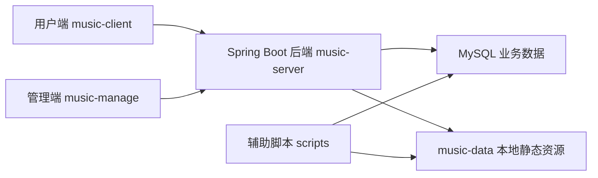
```mermaid
flowchart LR
    A["用户端 music-client"] --> C["Spring Boot 后端 music-server"]
    B["管理端 music-manage"] --> C
    C --> D["MySQL 业务数据"]
    C --> E["music-data 本地静态资源"]
    F["辅助脚本 scripts"] --> D
    F --> E
```

## 系统功能模块设计

从系统功能划分来看，本项目主要由用户端模块、后台管理模块、后端服务模块和资源维护模块四部分组成。

### 1. 用户端模块

用户端主要面向普通使用者，负责音乐系统的核心交互功能，包括：

- 首页推荐与内容展示
- 歌曲播放与歌词显示
- 歌手、歌曲、歌单的检索与浏览
- 用户登录、注册、个人信息维护
- 个人歌单与收藏相关操作

### 2. 后台管理模块

后台管理模块主要面向管理员，用于维护平台内容与基础数据，包括：

- 歌曲信息管理
- 歌单信息管理
- 用户信息管理
- 评论与反馈管理
- 轮播图与首页展示内容管理

### 3. 后端服务模块

后端服务模块是整个系统的业务核心，负责接收前端请求并完成统一处理，主要包括：

- 提供前后端交互所需的 REST 接口
- 处理歌曲、歌手、歌单、用户、评论等业务逻辑
- 负责数据库访问与数据持久化
- 提供本地静态资源访问与上传支持

### 4. 资源维护模块

资源维护模块主要由 `scripts` 目录下的辅助脚本组成，用于提升本地音乐库的维护效率，包括：

- 远程歌曲搜索与导入
- 歌词回填与格式修复
- 歌曲封面、歌手头像等资源补全
- 本地音频与图片资源健康检查

## 系统运行流程说明

系统运行时，用户或管理员首先通过前端页面发起请求，请求经由浏览器发送至 Spring Boot 后端。后端根据请求类型执行对应业务逻辑，一部分数据从 MySQL 数据库中读取或写入，另一部分与歌曲文件、封面图片等静态资源相关的内容则从 `music-data` 目录中获取。处理完成后，后端再将结果返回前端页面进行展示，从而完成一次完整的业务交互。对于本地音乐库的更新、歌词修复和封面补全等扩展操作，则通过辅助脚本离线执行，执行结果同步写入数据库和本地资源目录。

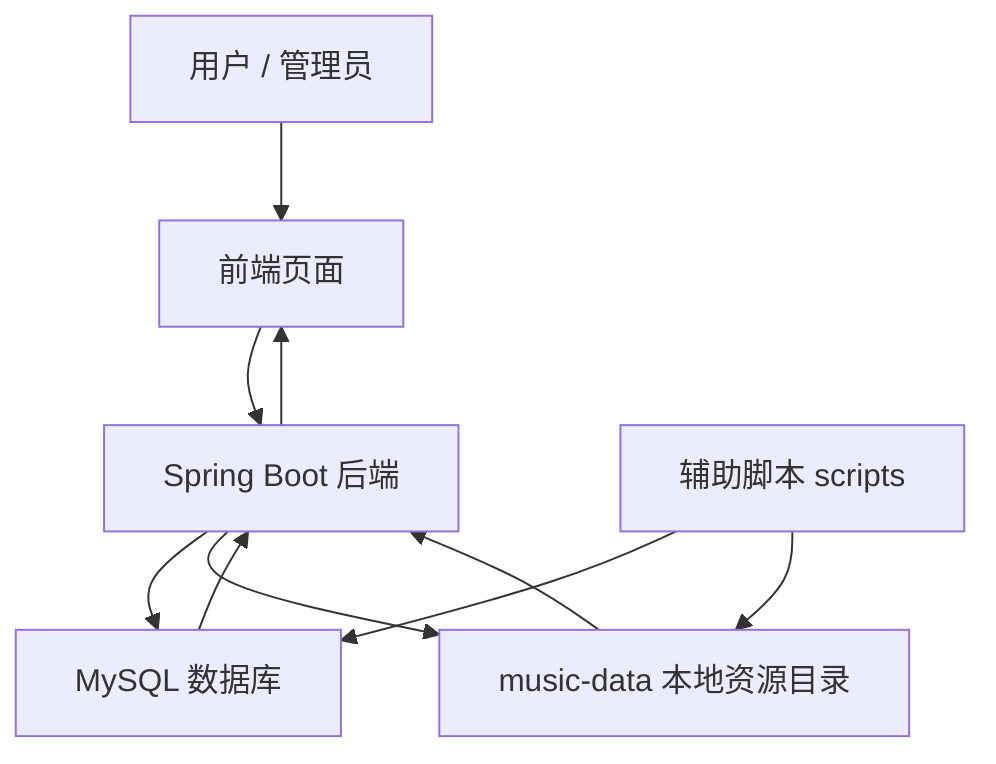
```mermaid
flowchart TD
    A["用户 / 管理员"] --> B["前端页面"]
    B --> C["Spring Boot 后端"]
    C --> D["MySQL 数据库"]
    C --> E["music-data 本地资源目录"]
    D --> C
    E --> C
    C --> B
    F["辅助脚本 scripts"] --> D
    F --> E
```

## 数据库设计说明

本系统数据库采用 MySQL 实现，围绕“用户、歌曲、歌手、歌单、评论与行为记录”几个核心对象进行建模。整体设计以歌曲播放业务为中心，通过主表与关联表相结合的方式组织数据，既满足用户端的查询展示需求，也支持后台管理端对内容的维护与审核。

从核心业务实体来看，`consumer` 表用于保存普通用户的基本信息，`admin` 表用于保存后台管理员账户信息；`singer` 表用于维护歌手资料，`song` 表用于维护歌曲信息，并通过 `singer_id` 与歌手建立关联；`song_list` 表用于表示歌单信息，`list_song` 表作为歌单与歌曲之间的中间关联表，用来实现一张歌单包含多首歌曲的多对多关系。

在互动与行为数据方面，系统使用 `comment` 表保存用户对歌曲或歌单的评论，使用 `user_support` 表记录评论点赞关系；`collect` 表用于保存用户收藏歌曲或歌单的行为；`rank_song` 与 `rank_list` 分别记录用户对歌曲和歌单的评分信息；`play_history` 表用于保存用户播放记录，便于后续进行播放统计与推荐分析。此外，`banner` 表用于维护首页轮播图，`feedback` 表用于保存用户反馈信息，支撑后台问题处理和系统改进。

在关系设计上，本系统采用“主实体表 + 业务关联表”的方式降低冗余。歌手与歌曲之间是一对多关系，用户与歌单之间是一对多关系，歌曲与歌单之间通过 `list_song` 实现多对多关系，用户与评论、收藏、评分、播放记录之间也通过外键或业务字段建立联系。该设计能够较好地支持音乐平台中的内容管理、互动评价、历史记录与推荐分析等功能需求。

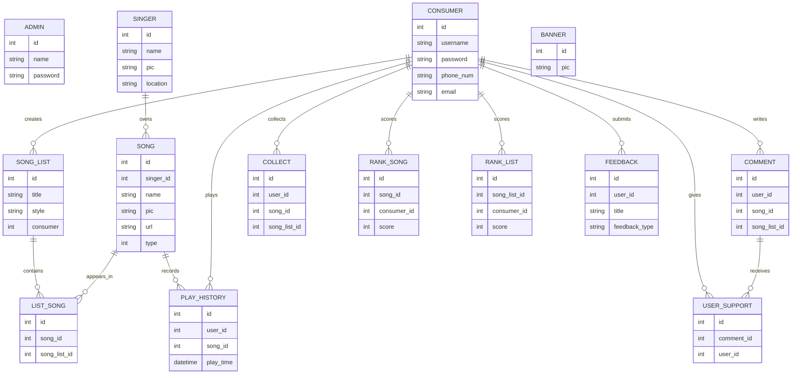
```mermaid
erDiagram
    ADMIN {
        int id
        string name
        string password
    }
    CONSUMER {
        int id
        string username
        string password
        string phone_num
        string email
    }
    SINGER {
        int id
        string name
        string pic
        string location
    }
    SONG {
        int id
        int singer_id
        string name
        string pic
        string url
        int type
    }
    SONG_LIST {
        int id
        string title
        string style
        int consumer
    }
    LIST_SONG {
        int id
        int song_id
        int song_list_id
    }
    COMMENT {
        int id
        int user_id
        int song_id
        int song_list_id
    }
    COLLECT {
        int id
        int user_id
        int song_id
        int song_list_id
    }
    RANK_SONG {
        int id
        int song_id
        int consumer_id
        int score
    }
    RANK_LIST {
        int id
        int song_list_id
        int consumer_id
        int score
    }
    PLAY_HISTORY {
        int id
        int user_id
        int song_id
        datetime play_time
    }
    USER_SUPPORT {
        int id
        int comment_id
        int user_id
    }
    BANNER {
        int id
        string pic
    }
    FEEDBACK {
        int id
        int user_id
        string title
        string feedback_type
    }

    SINGER ||--o{ SONG : owns
    CONSUMER ||--o{ SONG_LIST : creates
    SONG ||--o{ LIST_SONG : appears_in
    SONG_LIST ||--o{ LIST_SONG : contains
    CONSUMER ||--o{ COMMENT : writes
    COMMENT ||--o{ USER_SUPPORT : receives
    CONSUMER ||--o{ USER_SUPPORT : gives
    CONSUMER ||--o{ COLLECT : collects
    CONSUMER ||--o{ RANK_SONG : scores
    CONSUMER ||--o{ RANK_LIST : scores
    CONSUMER ||--o{ PLAY_HISTORY : plays
    SONG ||--o{ PLAY_HISTORY : records
    CONSUMER ||--o{ FEEDBACK : submits
```

## 关键功能实现说明

结合系统的实际实现情况，本项目的关键功能主要体现在用户认证、音乐播放、后台内容管理、个性化推荐和本地资源维护五个方面。这些功能共同支撑了在线音乐网站从前台交互到后台维护的完整业务闭环。

### 1. 用户认证与账号管理

用户认证功能由前端登录注册页面与后端 `ConsumerController` 协同完成。系统支持普通注册登录、邮箱登录、会话状态获取与退出登录等基础能力，并通过 `HttpSession` 保存当前登录用户信息，保证用户端与后台接口访问过程中的状态一致性。针对“忘记密码”场景，系统引入邮箱验证码校验流程，通过 Redis 临时保存验证码并设置有效期，再结合邮件发送服务完成密码找回，提高了账号管理功能的完整性与可用性。

### 2. 音乐播放与歌词联动实现

在用户端实现中，系统通过 Vuex 对当前播放歌曲、播放列表、播放进度、音量、歌词数据和自动切歌状态进行集中管理，从而保证不同页面之间的播放状态能够保持同步。后端通过 `LocalFileController` 负责本地音频与图片资源访问，其中音频接口支持基于 `Range` 请求头的分段传输，能够满足网页播放器对拖动进度条、续播和边播边载入等场景的需求。歌词文件在歌曲切换时与当前播放歌曲一起加载，实现了音乐播放与歌词显示的联动效果。

### 3. 后台内容管理与文件上传

后台管理端围绕歌曲、歌手、歌单、评论、用户、轮播图和反馈信息等对象构建管理页面，管理员可通过统一界面完成新增、编辑、删除和分页查询等操作。后端以 `SongController`、`SingerController`、`SongListController`、`CommentController`、`BannerController` 等控制器提供 REST 接口，并由服务层封装业务逻辑。对于歌曲音频、歌词文件、歌曲封面、歌手图片和轮播图等资源，系统通过 `FileUploadController` 按资源类型写入本地目录，在数据库中保存对应访问路径，实现“结构化数据存库、媒体资源存盘”的管理方式。

### 4. 个性化推荐与用户行为记录

系统在基础播放功能之外，还实现了与用户行为相关的数据采集与推荐接口。用户的播放历史、评论、收藏、评分等行为会被写入数据库，其中播放记录由 `/playHistory/add` 等接口维护，为后续推荐分析提供数据基础。在此基础上，后端 `RecommendController` 提供歌曲推荐、歌单推荐、歌手推荐以及偏好初始化等接口，使系统不仅能够完成基础内容展示，还具备一定的个性化推荐能力。

### 5. 本地资源维护与扩展脚本

考虑到在线音乐系统对音频、封面、歌词和歌手资料的依赖较强，项目额外设计了 `scripts` 辅助脚本目录，用于支持本地资源维护与扩展导入。以 `import-remote-music.py` 为代表的脚本可以完成远程歌曲搜索、导入、歌词回填、封面修复和资源检查等工作；PowerShell 脚本则用于批量补全图片与整理本地媒体资源。该部分功能并不直接参与前端页面交互，但显著提升了系统演示环境的可维护性，也为后续论文展示和数据补充提供了便利。

## 目录结构

```text
oline-music-website-main
├─ music-client      用户端前端
├─ music-manage      后台管理前端
├─ music-server      Spring Boot 后端
├─ music-data        本地音频、图片等运行资源目录
├─ scripts           导入、修复、审计等辅助脚本
├─ img               README 展示图片
├─ start-dev.bat     一键启动脚本
└─ stop-dev.bat      停止本地服务脚本
```

## 已实现的主要内容

- 首页推荐、歌单浏览、歌手与歌曲信息展示
- 用户登录、注册、个人资料与个人歌单管理
- 音乐播放、歌词显示、搜索功能
- 后台歌曲管理、歌单管理、评论管理、用户管理
- 本地静态资源读取与上传
- 远程歌曲导入与本地库修复辅助能力

## 项目界面展示

以下截图来自当前版本系统页面，用于展示用户端与后台管理端的主要功能界面。

### 用户端界面

#### 首页推荐
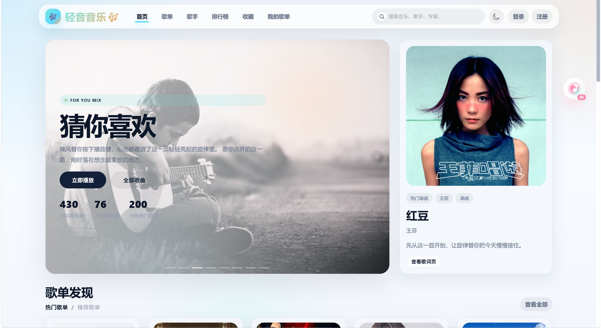

#### 歌单广场
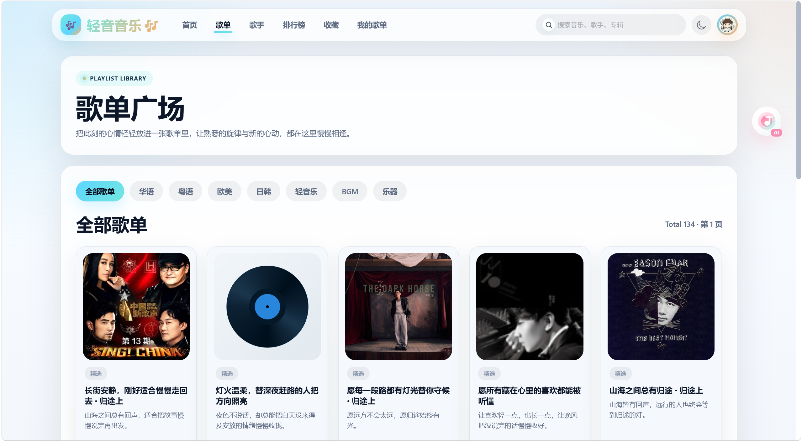

#### 排行榜
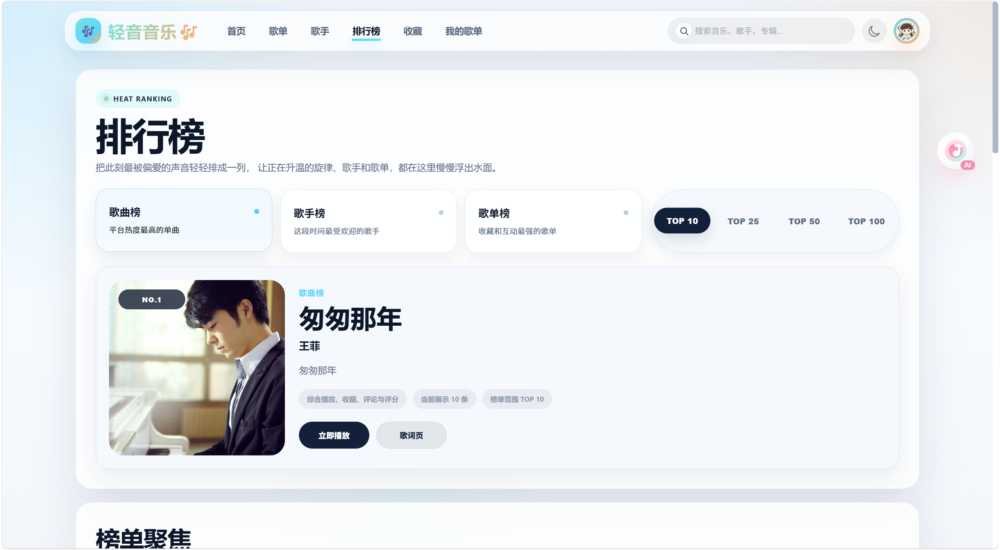

#### 歌手聚焦


#### 我的收藏
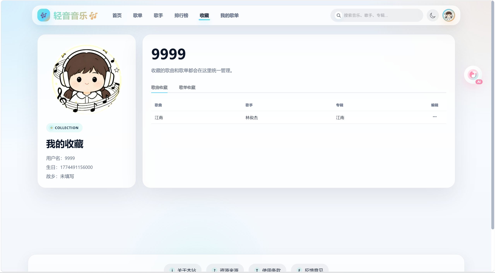

#### 个人中心与最近播放
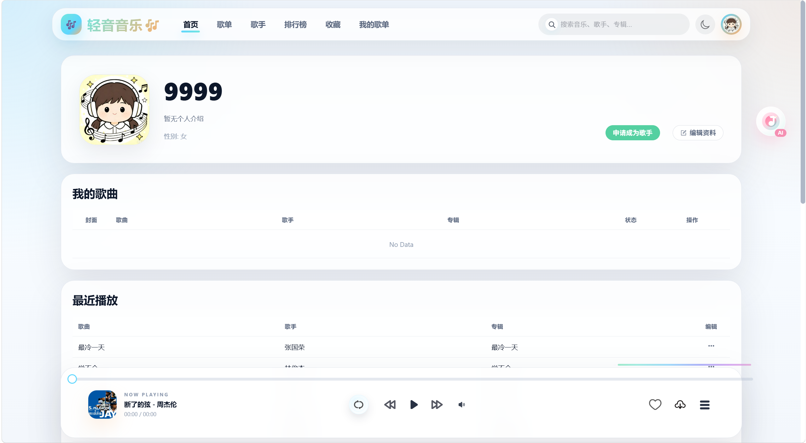

#### 我的歌单管理
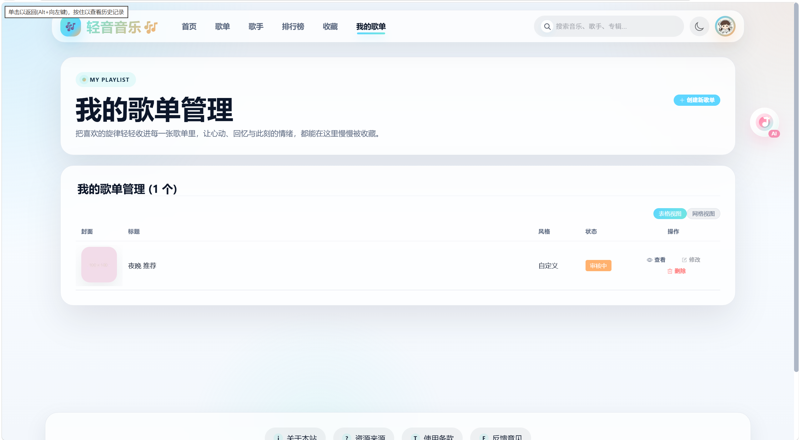

#### 歌词播放页
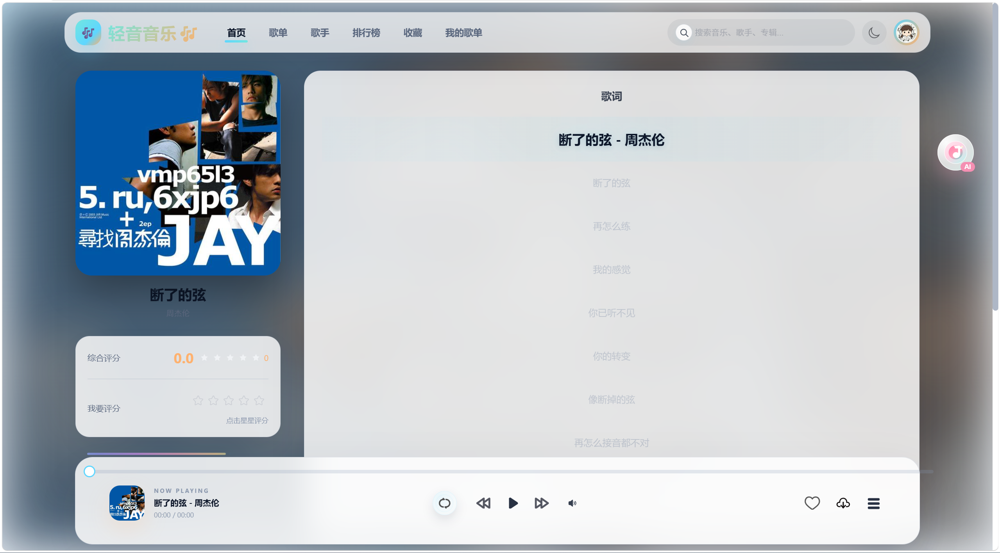

#### AI 小助手
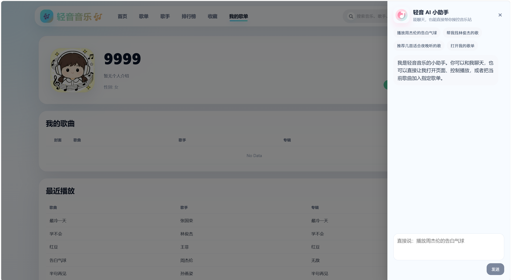

### 后台管理端界面

#### 系统首页
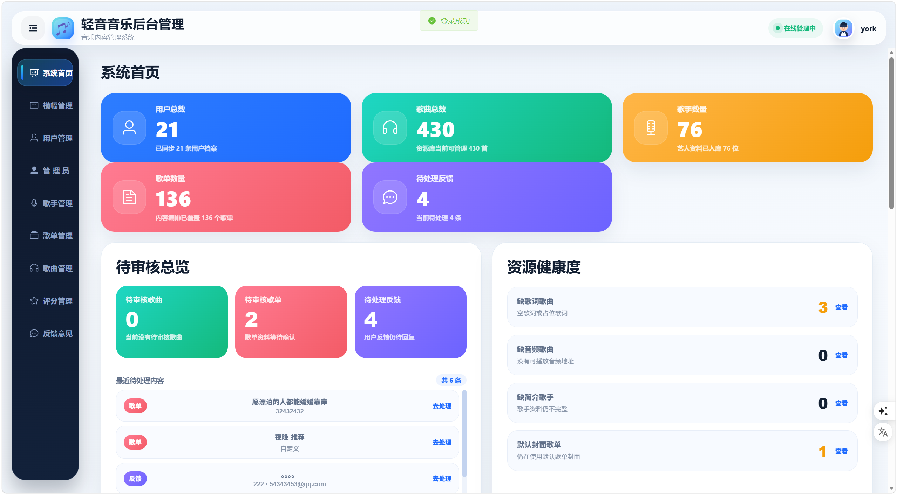

#### 轮播图管理
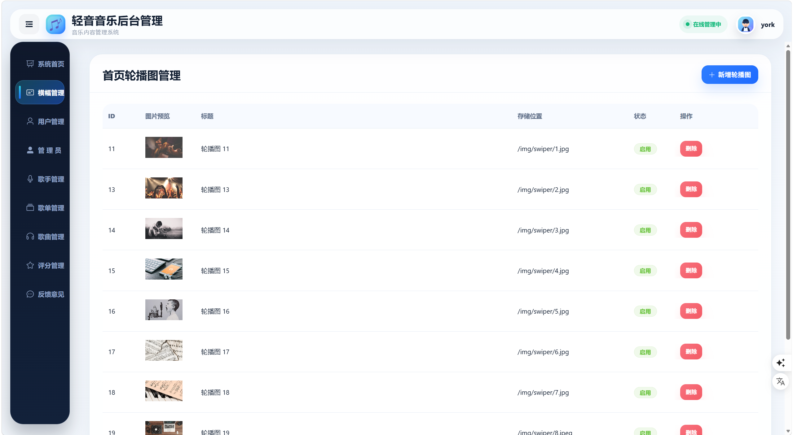

#### 用户管理
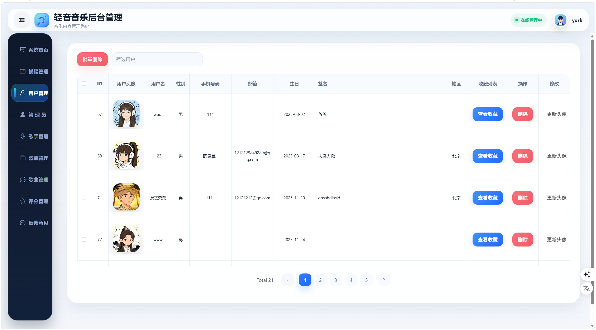

#### 管理员管理
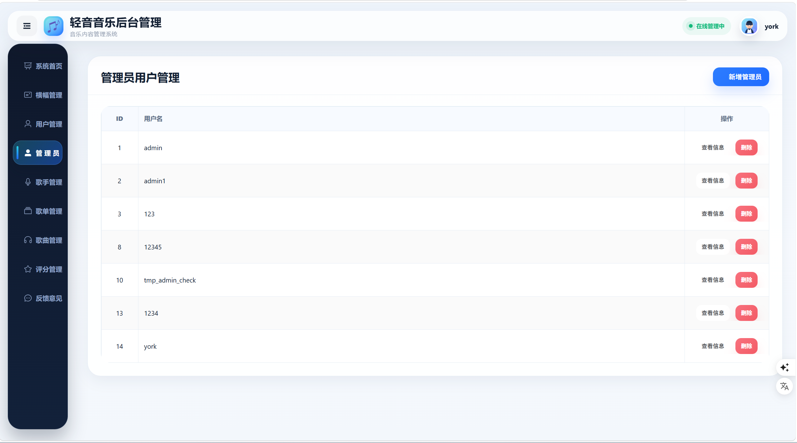

#### 歌手管理
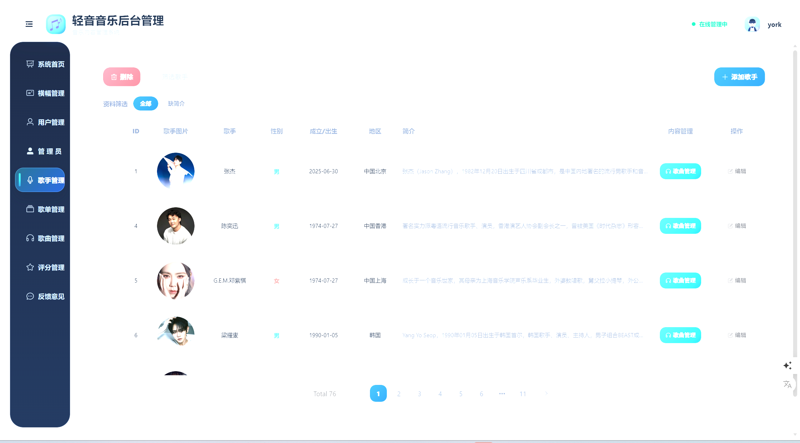

#### 歌单管理
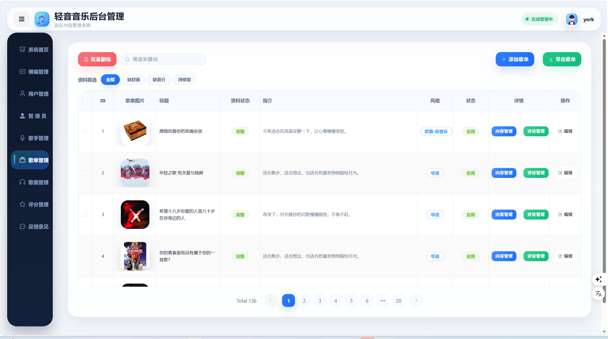

#### 歌曲管理
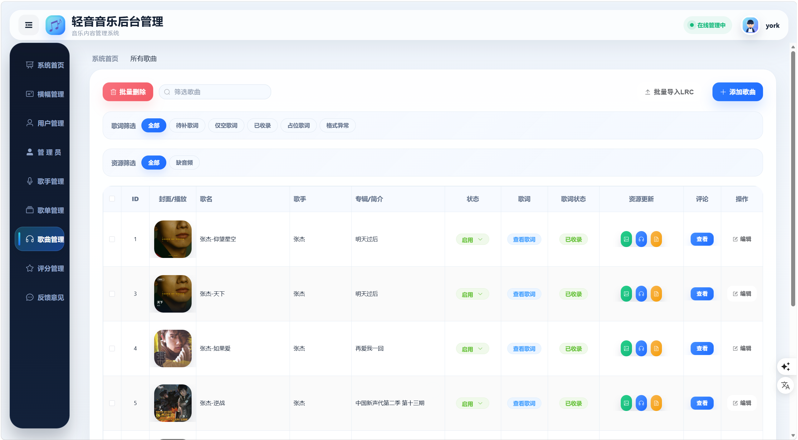

#### 评分管理
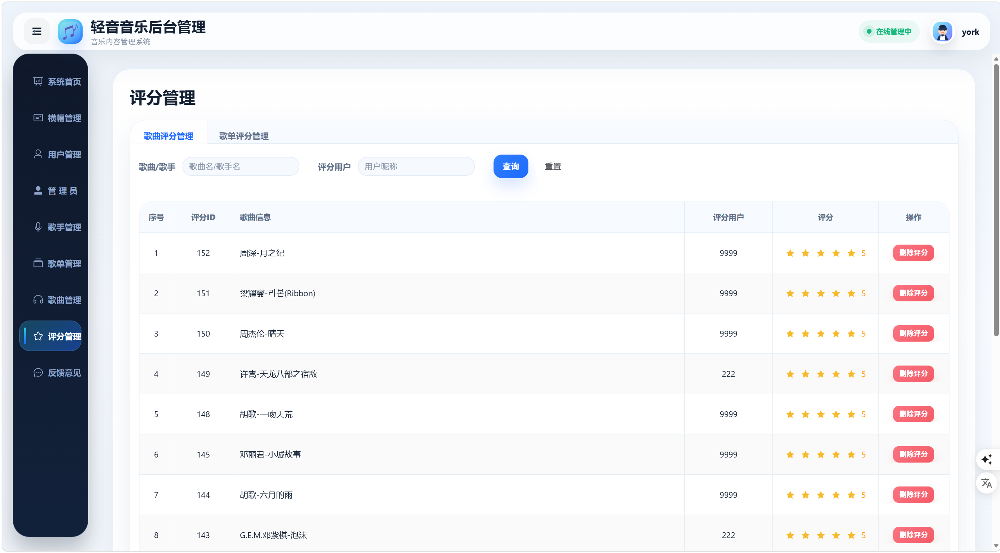

#### 反馈管理
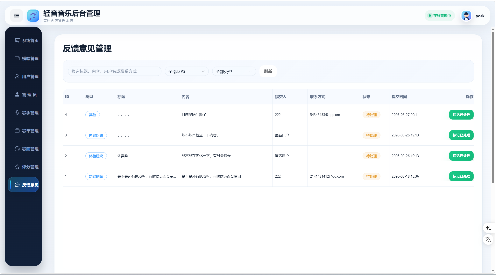

## 本地运行说明

### 环境要求

- JDK 8
- Node.js 14.x
- Maven 3.8.x
- MySQL 5.7 或 8.x

### 1. 初始化数据库

导入数据库脚本：

```text
music-server/tp_music.sql
```

### 2. 修改后端本地配置

后端开发配置文件位于：

```text
music-server/src/main/resources/application-dev.properties
```

请按本机环境修改以下内容：

- MySQL 地址、用户名、密码
- 本地静态资源目录 `local.file.storage-path`
- 如需启用 AI / 自动补歌功能，再按本机环境调整 Python 路径和脚本路径

### 3. 启动后端

```bash
cd music-server
mvn spring-boot:run
```

默认端口：

- 后端接口：`http://localhost:8888`

### 4. 启动用户端

```bash
cd music-client
npm install
npm run serve
```

默认端口：

- 用户端：`http://localhost:8080`

### 5. 启动管理端

```bash
cd music-manage
npm install
npm run serve
```

默认端口：

- 管理端：`http://localhost:8081`

### 6. 一键启动脚本

仓库中提供了 `start-dev.bat`、`start-backend-dev.bat`、`start-client-dev.bat`、`start-manage-dev.bat` 等脚本。

这些脚本更适合当前开发机环境使用；如果换电脑或准备公开仓库，建议优先参考上面的手动启动方式。

## 辅助脚本说明

项目中的 `scripts` 目录主要用于维护本地音乐库，典型用途包括：

- 从远程来源搜索并导入歌曲
- 回填歌词、封面、歌手资料
- 修复音频、图片、歌单等资源异常

常用脚本：

```text
scripts/import-remote-music.py
```

示例命令：

```bash
python scripts/import-remote-music.py search --keyword "周杰伦 稻香" --source all --limit 5
python scripts/import-remote-music.py import --keyword "周杰伦 稻香" --source gequbao --index 1
python scripts/import-remote-music.py repair-library --song-id-min 200 --singer-id-min 65
```

## 说明

- `music-data` 为本地运行资源目录，通常体积较大，更适合作为本地数据目录，不建议直接作为公开仓库的完整上传内容
- 当前仓库更适合用于项目展示、代码阅读和毕业设计说明
- 如果用于 GitHub 展示，建议保留源码、README 和截图，按需精简本地运行资源
